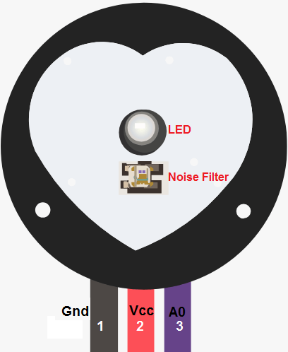
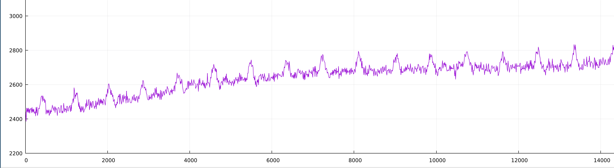

# Description

This is an example program that runs on a
[stm32f3 discovery board](https://www.st.com/en/evaluation-tools/stm32f3discovery.html)
and reports ADC readings for pin PA2

# Hardware details

## Discovery board

*STM32F3 Discovery* board should be quite commonly available, including on
[AliExpress](https://www.aliexpress.com/wholesale?SearchText=STM32F3DISCOVERY)


## Pulse sensor

The *Pulse Sensor* is one of the lowest cost models found on AliExpress,
Generally searching as [pulsesensor](https://www.aliexpress.com/wholesale?SearchText=pulsesensor).

It looks like this:



You can find more details about how it works around the web, 
like at [Last Minute Engineers](https://lastminuteengineers.com/pulse-sensor-arduino-tutorial/).

## Connections

- `GND` of the sensor is connected to `GND` of the discovery board
- `Vcc` of the sensor is connected to `3V` of the discovery board
- `A0` (Sig) of the sensor is connected to the `PA2` pin of the discovery board

# Execution

You can just execute the binary and it will use RTT to display timestamp + pulse value

```sh
cargo run
```

You can feed it to plotting. A very basic version would be:

```sh
cargo run | feedgnuplot --stream --domain --lines
```

If you place your finger on the sensor (with some fiddling on pressure
and how it is held), this results in an output that looks like:




